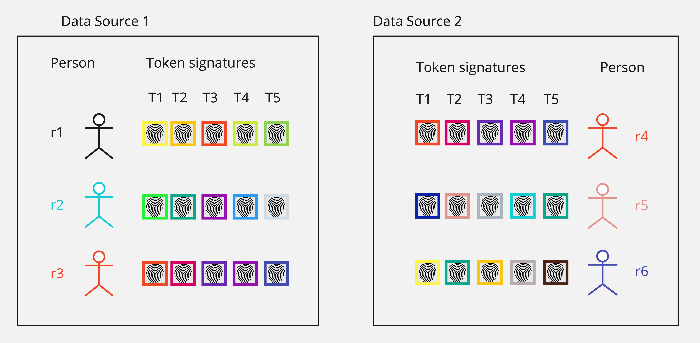

# OpenToken  <!-- omit in toc -->

## Introduction

Our approach to person matching relies on building a set of matching tokens (or token signatures) per person which are derived from deterministic person data but preserve privacy by using cryptographically secure hashing algorithms.

- [Introduction](#introduction)
- [Highlights](#highlights)
- [Demo](#demo)
- [Overview](#overview)
- [Usage](#usage)
    - [Available Commands](#available-commands)
- [Quick Start](#quick-start)
- [Development \& Documentation](#development--documentation)
- [Contributing](#contributing)

## Highlights

- Multi-language Support
- Cryptographically Secure encryption that prevents re-identification
- Enables straightforward person-matching by comparing 5 deterministic and unique tokens, providing a high degree of confidence in matches

## Demo

New to OpenToken? Start with the **[PPRL Superhero Demo](demos/pprl-superhero-example/)** — a beginner-friendly, end-to-end walkthrough showing how two parties (hospital and pharmacy) can privately find matching records without exposing raw identifiers.

The demo includes:

- **Interactive Jupyter notebook** with step-by-step explanations
- **One-command runner** (`run_end_to_end.sh`) for quick execution
- Synthetic superhero dataset generation
- Token generation and overlap analysis examples

Perfect for understanding privacy-preserving record linkage concepts before diving into production use.

## Overview

### Library <!-- omit in toc -->

This project, `OpenToken`, provides common utilities, models, and services used across the person matching system. It is designed to support the development of applications and services that require person matching capabilities, ensuring consistency and efficiency.

### Token Generation <!-- omit in toc -->

Tokens are cryptographically secure hashes computed from multiple deterministic person attributes. Tokens are created based on a set of `token generation rules`. We use multiple distinct token generation rules that define a set of person attributes and which parts of those attributes to use for token generation.

### Sample Token Generation Rules <!-- omit in toc -->

| Rule ID | Rule Definition                                          |
| ------- | -------------------------------------------------------- |
| T1      | `U(last-name)\|U(first-name-1)\|U(sex)\|birth-date`      |
| T2      | `U(last-name)\|U(first-name)\|birth-date\|postal-code-3` |
| T3      | `U(last-name)\|U(first-name)\|U(sex)\|birth-date`        |
| T4      | `social-security-number\|U(sex)\|birth-date`             |
| T5      | `U(last-name)\|U(first-name-3)\|U(sex)`                  |

> U(X) = uppercase(X)<br>
> attribute-N = take first N characters from the `attribute`

### Token Encryption Process <!-- omit in toc -->

A token signature is generated first for every token generation rule. The token signature is then cryptographically hashed and hex encoded to generate the token.

> $Token(R) = Hex(Sha256(TokenSignature(R)))$ where R is the rule ID.<br>
> The token is then transformed further using the formula below:<br>
> $Base64(AESEncrypt(Base64(HMACSHA256(Token(R)))))$<br>

### Example <!-- omit in toc -->

Given a person with the following attributes:

```csv
RecordId,FirstName,LastName,PostalCode,Sex,BirthDate,SocialSecurityNumber
891dda6c-961f-4154-8541-b48fe18ee620,John,Doe,98004,Male,2000-01-01,123-45-6789
```

**Note:** No attribute value can be empty to be considered valid.

The token generation rules above generate the following token signatures:

| Rule ID | Token Signature               | Token                                                                                              |
| ------- | ----------------------------- | -------------------------------------------------------------------------------------------------- |
| T1      | `DOE\|J\|MALE\|2000-01-01`    | `Gn7t1Zj16E5Qy+z9iINtczP6fRDYta6C0XFrQtpjnVQSEZ5pQXAzo02Aa9LS9oNMOog6Ssw9GZE6fvJrX2sQ/cThSkB6m91L` |
| T2      | `DOE\|JOHN\|2000-01-01\|980`  | `pUxPgYL9+cMxkA+8928Pil+9W+dm9kISwHYPdkZS+I2nQ/bQ/8HyL3FOVf3NYPW5NKZZO1OZfsz7LfKYpTlaxyzMLqMF2Wk7` |
| T3      | `DOE\|JOHN\|MALE\|2000-01-01` | `rwjfwIo5OcJUItTx8KCoSZMtr7tVGSyXsWv/hhCWmD2pBO5JyfmujsosvwYbYeeQ4Vl1Z3eq0cTwzkvfzJVS/EKaRhtjMZz5` |
| T4      | `123456789\|MALE\|2000-01-01` | `9o7HIYZkhizczFzJL1HFyanlllzSa8hlgQWQ5gHp3Niuo2AvEGcUwtKZXChzHmAa8Jm3183XVoacbL/bFEJyOYYS4EQDppev` |
| T5      | `DOE\|JOH\|MALE`              | `QpBpGBqaMhagfcHGZhVavn23ko03jkyS9Vo4qe78E4sKw+Zq2CIw4MMWG8VXVwInnsFBVk6NSDUI79wECf5DchV5CXQ9AFqR` |

**Note:** The tokens in the example above have been generated using the hash key `HashingKey` and encryption key `Secret-Encryption-Key-Goes-Here.`

### Data Flow  <!-- omit in toc -->


### Validation of Person Attributes  <!-- omit in toc -->

The person attributes are validated before normalization. The validation rules are as follows:

| Attribute Name         | Validation Rule                                                                                                                                                                                                                                                                                                                                                                                                                                                                                                                                                                                                                  |
| ---------------------- | -------------------------------------------------------------------------------------------------------------------------------------------------------------------------------------------------------------------------------------------------------------------------------------------------------------------------------------------------------------------------------------------------------------------------------------------------------------------------------------------------------------------------------------------------------------------------------------------------------------------------------- |
| `FirstName`            | Cannot be a placeholder value (e.g., "Unknown", "Test", "NotAvailable", "Patient", "Sample", "Anonymous", "Missing", etc.). Must not be null or empty.                                                                                                                                                                                                                                                                                                                                                                                                                                                                           |
| `LastName`             | Must be at least 2 characters long. For 2-character names, must contain at least one vowel or be "Ng". Cannot be a placeholder value (e.g., "Unknown", "Test", "NotAvailable", "Patient", "Sample", "Anonymous", "Missing", etc.). Must not be null or empty.                                                                                                                                                                                                                                                                                                                                                                    |
| `BirthDate`            | Must be after January 1, 1910. Cannot be in the future (after today's date). Must be in a valid date format.                                                                                                                                                                                                                                                                                                                                                                                                                                                                                                                     |
| `PostalCode`           | Must be a valid US ZIP code (3, 4, 5, or 9 digits) or Canadian postal code (3, 4, 5, or 6 characters). **US ZIP codes:** `ddd` (ZIP-3, padded to `ddd00`), `dddd` (ZIP-4, padded to `dddd0`), `ddddd` or `ddddd-dddd`. **Canadian postal codes:** `AdA` (3-char, padded to `AdA 000`), `AdAd` or `AdA d` (4-char, padded to `AdA dA0`), `AdAdA` or `AdA dA` (5-char, padded to `AdA dA0`), or `AdA dAd` (full format). Invalid ZIP-3 codes: US `000`, `555`, `888`; Canadian `K1A`, `M7A`, `H0H`. Cannot be common placeholder values like `11111`, `12345`, `54321`, `98765` for US or `A1A 1A1`, `X0X 0X0` for Canadian codes. |
| `SocialSecurityNumber` | Area cannot be `000`, `666` or `900-999`. Group cannot be `00`. Serial cannot be `0000`. Cannot be one of the following invalid sequences: `111-11-1111`, `222-22-2222`, `333-33-3333`, `444-44-4444`, `555-55-5555`, `777-77-7777`, `888-88-8888`.                                                                                                                                                                                                                                                                                                                                                                              |

### Normalization of Person Attributes  <!-- omit in toc -->

All attribute values get normalized as part of their processing after validation. The normalization process includes:

**FirstName normalization:**

- Removes titles (e.g., "Dr. John" → "John")
- Removes middle initials (e.g., "John J" → "John")
- Removes trailing periods (e.g., "John J." → "John")
- Removes generational suffixes (e.g., "Henry IV" → "Henry")
- Removes non-alphabetic characters (e.g., "Anne-Marie" → "AnneMarie")
- Normalizes diacritics (e.g., "José" → "Jose")

**LastName normalization:**

- Removes generational suffixes (e.g., "Warner IV" → "Warner")
- Removes non-alphabetic characters (e.g., "O'Keefe" → "OKeefe")
- Normalizes diacritics (e.g., "García" → "Garcia")

| Attribute Name           | Normalized Format                                                                                                                                                                                                                                                                                                                       |
| ------------------------ | --------------------------------------------------------------------------------------------------------------------------------------------------------------------------------------------------------------------------------------------------------------------------------------------------------------------------------------- |
| `record-id`              | Any unique string identifier (optional - auto-generated UUID if not provided)                                                                                                                                                                                                                                                           |
| `first-name`             | Any string (after normalization as described above)                                                                                                                                                                                                                                                                                     |
| `last-name`              | Any string (after normalization as described above)                                                                                                                                                                                                                                                                                     |
| `postal-code`            | US: `ddddd` where `d` is a numeric digit (0-9). Canadian: `AdA dAd` where `A` is a letter and `d` is a digit. Partial postal codes are automatically padded during normalization: US ZIP-3 (`ddd` → `ddd00`), ZIP-4 (`dddd` → `dddd0`); Canadian 3-char (`AdA` → `AdA 000`), 4-char (`AdAd` → `AdA dA0`), 5-char (`AdAdA` → `AdA dA0`). |
| `sex`                    | `Male\|Female`                                                                                                                                                                                                                                                                                                                          |
| `birth-date`             | `YYYY-MM-DD` where `MM` is (01-12), `DD` is (01-31)                                                                                                                                                                                                                                                                                     |
| `social-security-number` | `ddddddddd` where `d` is a numeric digit (0-9)                                                                                                                                                                                                                                                                                          |

### How Token Matching Works  <!-- omit in toc -->

This library focuses primarily on token generation. Even though the person matching process is beyond the scope of this library, this document discusses how these tokens work in a person matching system.

As noted above, N distinct tokens are generated for each person using this library. The output of this process is below for three person records r1, r2, and r3:

| RecordId | RuleId | Token(RecordId, RuleId) |
| -------- | ------ | ----------------------- |
| r1       | T1     | Token(r1,T1)            |
| r1       | T2     | Token(r1,T2)            |
| r1       | T3     | Token(r1,T3)            |
| r1       | T4     | Token(r1,T4)            |
| r1       | T5     | Token(r1,T5)            |
| r2       | T1     | Token(r2,T1)            |
| r2       | T2     | Token(r2,T2)            |
| r2       | T3     | Token(r2,T3)            |
| r2       | T4     | Token(r2,T4)            |
| r2       | T5     | Token(r2,T5)            |
| r3       | T1     | Token(r3,T1)            |
| r3       | T2     | Token(r3,T2)            |
| r3       | T3     | Token(r3,T3)            |
| r3       | T4     | Token(r3,T4)            |
| r3       | T5     | Token(r3,T5)            |

If tokens are generated for persons from multiple data sources, person matching systems can identify a person match if the tokens for a person from one data source matches tokens for another person from a different data source. In the picture below, all tokens for **r3** and **r4** match, and as such r3 and r4 are considered a match.



### PySpark Bridge <!-- omit in toc -->

For large-scale, distributed token generation and dataset overlap analysis, use the PySpark bridge library located at lib/python/opentoken-pyspark. It provides a `Spark`-friendly processor and helper utilities.

Getting started examples are available in the notebooks: lib/python/opentoken-pyspark/notebooks/ (e.g., Custom_Token_Definition_Guide.ipynb, Dataset_Overlap_Analysis_Guide.ipynb).

## Usage

### CLI Arguments  <!-- omit in toc -->

OpenToken CLI is now **ECDH-only** and uses a **subcommand-based interface** for clear operation separation.

#### Available Commands

**`generate-keypair`** - Generate a new ECDH key pair
- `--ecdh-curve`: Elliptic curve name (default: P-256)
- `--output-dir`: Directory to save keys (default: ~/.opentoken)

**`tokenize`** - Tokenize person attributes using ECDH key exchange

*Required:*
- `-i | --input`: Input file path containing person attributes
- `-t | --type`: Input file type (`csv` or `parquet`)
- `-o | --output`: Output file path for tokens (`.zip` recommended for automatic packaging)
- `--receiver-public-key`: Path to receiver's public key file

*Optional:*
- `-ot | --output-type`: Output file type if different from input (defaults to input type)
- `--sender-keypair-path`: Path to sender's private key file (default: `~/.opentoken/keypair.pem`)
- `--hash-only`: Hash-only mode (generates hashed tokens without encryption)
- `--ecdh-curve`: Elliptic curve name (default: P-256)

**`decrypt`** - Decrypt tokens using ECDH key exchange

*Required:*
- `-i | --input`: Input file path (or ZIP package)
- `-t | --type`: Input file type (`csv` or `parquet`)
- `-o | --output`: Output file path

*Optional:*
- `-ot | --output-type`: Output file type if different from input
- `--sender-public-key`: Path to sender's public key file (extracted from ZIP if not provided)
- `--receiver-keypair-path`: Path to receiver's private key file (default: `~/.opentoken/keypair.pem`)
- `--ecdh-curve`: Elliptic curve name (default: P-256)

**Note:** Hashing and encryption keys are automatically derived from the ECDH key exchange. No manual secrets needed.

### Input/Output Formats  <!-- omit in toc -->

**Input:** CSV or Parquet files with these person attribute columns:

| Accepted Column Names                              | Required | Accepted Values                                                                                                                                                                                                         |
| -------------------------------------------------- | -------- | ----------------------------------------------------------------------------------------------------------------------------------------------------------------------------------------------------------------------- |
| RecordId, Id                                       | Optional | Any unique string identifier. If not provided, a unique UUID will be automatically generated for each row.                                                                                                              |
| FirstName, GivenName                               | Required | Any string value                                                                                                                                                                                                        |
| LastName, Surname                                  | Required | Any string value                                                                                                                                                                                                        |
| PostalCode, ZipCode, ZIP3, ZIP4, ZIP5              | Required | US: 3 (ZIP-3), 4, 5, or 9 digit ZIP code `ddd`, `ddddd` or `ddddd-dddd`. Canadian: 3 (ZIP-3) or 6 character postal code `AdA` or `AdAdAd` (with or without space). ZIP-3 codes are automatically padded to full length. |
| Sex, Gender                                        | Required | `Male`, `M`, `Female`, `F`                                                                                                                                                                                              |
| BirthDate, DateOfBirth                             | Required | Dates in either format: `yyyy/MM/dd`, `MM/dd/yyyy`, `MM-dd-yyyy`, `dd.MM.yyyy`                                                                                                                                          |
| SocialSecurityNumber, NationalIdentificationNumber | Required | 9 digit number, with or without dashes, e.g. `ddd-dd-dddd`                                                                                                                                                              |

**Output:** 
- Token files (CSV or Parquet) with columns: `RecordId`, `RuleId`, `Token` (encrypted, base64-encoded)
- Metadata JSON with processing statistics, elliptic curve used, and system information
- ZIP archive (recommended): auto-packages tokens, metadata, and sender's public key

**Notes:**
- RecordId is optional; UUIDs auto-generated if omitted
- No attribute values (except RecordId) can be empty
- For actual record linkage, provide real RecordIds from your source system

For complete metadata documentation, see [Metadata Format](./docs/metadata-format.md).

## Quick Start

### Public Key Exchange Workflow (Recommended for Production)  <!-- omit in toc -->

For secure token exchange without sharing secrets, use the public-key cryptography workflow with ECDH key exchange. This approach is more secure and suitable for production environments where multiple parties need to exchange encrypted tokens.

📘 **[Complete End-to-End Workflow Guide](./docs/public-key-workflow.md)**

**Quick Overview:**

1. **Receiver generates key pair** → saves to `~/.opentoken/`
2. **Receiver shares public key** → `receiver_public_key.pem`
3. **Sender uses receiver's public key** → generates tokens with derived keys
4. **Output includes sender's public key** → packaged as ZIP
5. **Receiver decrypts** → uses sender's public key to derive same keys

**Benefits:**
- ✅ No shared secrets transmitted
- ✅ Each party maintains their own private key
- ✅ Perfect forward secrecy (ephemeral keys)
- ✅ NIST-compliant P-256 elliptic curve
- ✅ Separate hashing and encryption keys via HKDF

📘 **[Complete End-to-End Workflow Guide](./docs/public-key-workflow.md)** with command-line instructions for both Java and Python.

### Docker  <!-- omit in toc -->

You can build and run OpenToken via Docker using the convenience scripts:

**Bash (Linux/Mac):**

```bash
./run-opentoken.sh tokenize -i ./resources/sample.csv -o ./resources/output.zip -t csv \
  --receiver-public-key /path/to/receiver_public_key.pem
```

**PowerShell (Windows):**

```powershell
.\run-opentoken.ps1 tokenize -i .\resources\sample.csv -o .\resources\output.zip -FileType csv `
  -ReceiverPublicKey C:\path\to\receiver_public_key.pem
```

Or build and run manually (from repository root):

```shell
# Build the Docker image
docker build -t opentoken:latest .

# Run with ECDH
docker run --rm -v $(pwd)/resources:/app/resources \
  opentoken:latest tokenize \
  -i /app/resources/sample.csv -t csv -o /app/resources/output.zip \
  --receiver-public-key /app/resources/receiver_public_key.pem
```

**Note:** These commands must be run from the repository root directory.
The Docker container mounts the `resources` directory to access input files and write output files.

## Development & Documentation

Central reference: [Development Guide](docs/dev-guide-development.md) (setup, build, testing, versioning, dev container, registration, contribution checklist).

Key anchors in the guide:

- Language Development: [Java & Python](docs/dev-guide-development.md#3-language-development-java--python)
- Registration: [Token & Attribute Registration](docs/dev-guide-development.md#4-token--attribute-registration)

Additional documentation:

- **[Public-Key Exchange Workflow](docs/public-key-workflow.md)** - End-to-end guide with command-line instructions for ECDH key exchange
- [Public-Key Cryptography Implementation Plan](docs/public-key-implementation-plan.md) - Comprehensive technical analysis and roadmap for transitioning from secret-based to public-key cryptography (v1.13.0)
- [Metadata Format](docs/metadata-format.md) - Documentation for OpenToken metadata files
- [Branch Workflow and Release Process](docs/branch-workflow-and-release-process.md) - Git workflow and release procedures

Quick parity note: Java and Python implementations produce identical tokens for the same normalized input values.

### Project Structure <!-- omit in toc -->

```
lib/
├── java/
│   ├── pom.xml              # Parent POM (multi-module Maven build)
│   ├── opentoken/           # Core tokenization library
│   └── opentoken-cli/       # CLI application with I/O support (CSV, Parquet)
├── python/
│   ├── opentoken/           # Core tokenization library
│   ├── opentoken-cli/       # CLI application with I/O support
│   └── opentoken-pyspark/   # PySpark bridge for distributed processing
tools/                       # Utility scripts and tools
docs/                        # Documentation
.devcontainer/               # Development container configuration
```

### Development Environment  <!-- omit in toc -->

Use the Dev Container for a reproducible setup (Java, Maven, Python). See the [Development Guide](docs/dev-guide-development.md#7-development-container) for details.

### Test Data  <!-- omit in toc -->

You can generate mock person data in the expected format for testing purposes.

#### Prerequisites  <!-- omit in toc -->

- Python3
- [faker](https://pypi.org/project/Faker/)

#### Generating Mock Data  <!-- omit in toc -->

Navigate to `tools/mockdata/` to find the data generation script. Run it with pre-configured defaults:

```shell
./generate.sh
```

You can modify the parameters when running the script directly. The script will repeat a percentage of the record values using a different record ID.

```shell
# python data_generator.py <number of records> <percentage of repeated records> <output file name>
python data_generator.py 100 0.05 test_data.csv
```

The script generates fake person data and optionally repeats a percentage of records with different record IDs to simulate duplicate persons.

## Contributing

We welcome contributions including features, bug fixes, documentation updates, and more. Key areas for improvement include:

1. **File Format Support**: The library currently supports CSV and Parquet. Additional readers/writers for other formats are highly desired.
2. **Test Coverage**: Expanding unit tests and integration tests.
3. **Language Implementations**: Adding support for additional programming languages.

### Before Contributing  <!-- omit in toc -->

Please ensure you follow the project's coding standards:

- **Java**: Follow Checkstyle rules and add Javadoc for public APIs
- **Version Bumping**: Use `bump2version` for all PRs (required)
- **Testing**: Run `mvn clean install` to ensure everything works

See the [contribution guidelines](.github/copilot-instructions.md) for detailed requirements.