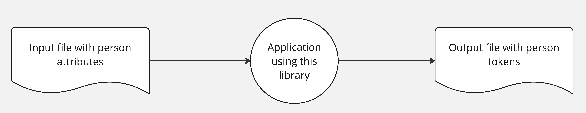

# OpenToken Documentation

Welcome to the OpenToken documentation! OpenToken is a dual-implementation (Java/Python) library for privacy-preserving person matching using cryptographically secure token generation.

## Quick Links

- 📖 [Main README](https://github.com/mattwise-42/OpenToken#readme) - Overview, usage, and quick start
- 🛠️ [Development Guide](dev-guide-development) - Setup, build instructions, and contribution guidelines
- 📊 [Metadata Format](metadata-format) - Understanding metadata output files

## What is OpenToken?

OpenToken enables privacy-preserving person matching by generating cryptographically secure tokens from deterministic person attributes (name, birthdate, SSN, etc.). The library supports:

- **Multi-language Support** - Identical implementations in Java and Python
- **Cryptographically Secure** - AES-256 encryption prevents re-identification
- **Deterministic Matching** - Compare 5 unique tokens for high-confidence matches

## Key Features

### Token Generation Rules

OpenToken uses 5 distinct token generation rules (T1-T5) that combine different person attributes:

| Rule ID | Rule Definition |
|---------|----------------|
| T1 | `U(last-name)\|U(first-name-1)\|U(sex)\|birth-date` |
| T2 | `U(last-name)\|U(first-name)\|birth-date\|postal-code-3` |
| T3 | `U(last-name)\|U(first-name)\|U(sex)\|birth-date` |
| T4 | `social-security-number\|U(sex)\|birth-date` |
| T5 | `U(last-name)\|U(first-name-3)\|U(sex)` |

> U(X) = uppercase(X)  
> attribute-N = take first N characters from the attribute

### Token Encryption Process

Tokens are generated using a multi-step cryptographic process:

$$Token(R) = Base64(AES-Encrypt(Base64(HMAC-SHA256(Hex(SHA256(TokenSignature(R)))))))$$

Where R is the rule ID (T1-T5).

## Getting Started

### Java Quick Start

```bash
cd lib/java
mvn clean install
java -jar target/opentoken-*.jar \
  -i ../../resources/sample.csv -t csv -o target/output.csv \
  -h "HashingKey" -e "Secret-Encryption-Key-Goes-Here."
```

### Python Quick Start

```bash
cd lib/python
python -m venv .venv && source .venv/bin/activate
pip install -r requirements.txt -r dev-requirements.txt -e .
PYTHONPATH=src/main python src/main/opentoken/main.py \
  -i ../../resources/sample.csv -t csv -o target/output.csv \
  -h "HashingKey" -e "Secret-Encryption-Key-Goes-Here."
```

## Data Flow



## Accepted Input Format

The input file (CSV or Parquet) must contain the following columns:

| Column Names | Required | Accepted Values |
|-------------|----------|-----------------|
| RecordId, Id | Optional | Any unique string identifier (UUID auto-generated if omitted) |
| FirstName, GivenName | Required | Any string value |
| LastName, Surname | Required | Any string value |
| PostalCode, ZipCode | Required | US: 5 or 9 digit ZIP; Canadian: A1A 1A1 format |
| Sex, Gender | Required | Male, M, Female, F |
| BirthDate, DateOfBirth | Required | yyyy/MM/dd, MM/dd/yyyy, MM-dd-yyyy, dd.MM.yyyy |
| SocialSecurityNumber, NationalIdentificationNumber | Required | 9 digits with or without dashes |

## Validation Rules

Person attributes are validated before normalization:

- **FirstName/LastName**: Cannot be placeholder values (Unknown, Test, etc.)
- **BirthDate**: Must be after January 1, 1910 and not in the future
- **PostalCode**: Valid US ZIP or Canadian postal code (no placeholders like 00000)
- **SSN**: Area ≠ 000/666/900-999, Group ≠ 00, Serial ≠ 0000

See the [main README](https://github.com/mattwise-42/OpenToken#readme) for complete validation and normalization details.

## Contributing

We welcome contributions! Key areas for improvement:

1. **File Format Support** - Additional readers/writers (currently CSV & Parquet)
2. **Test Coverage** - Expanding unit and integration tests
3. **Language Implementations** - Support for additional programming languages

Before contributing:
- Follow Checkstyle rules (Java) and coding standards
- Use `bump2version` for all PRs (required)
- Run `mvn clean install` to ensure tests pass

See the [Development Guide](dev-guide-development) for detailed contribution guidelines.

## License

OpenToken is open source. See the [LICENSE](https://github.com/mattwise-42/OpenToken/blob/main/LICENSE) file for details.

## Support

- 🐛 [Report Issues](https://github.com/mattwise-42/OpenToken/issues)
- 💬 [Discussions](https://github.com/mattwise-42/OpenToken/discussions)
- 📧 Contact the maintainers through GitHub

---

*Last updated: {{ site.time | date: '%B %d, %Y' }}*
